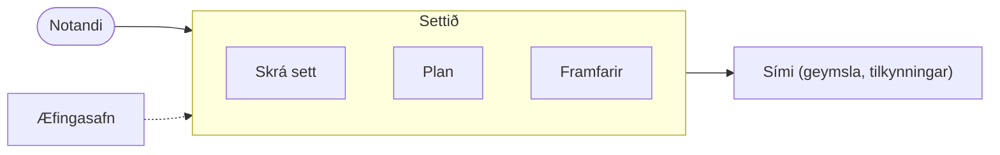

# 🧭 System Description Specification (SDS)

## Númer teymis og höfundar
Teymi 1: Hilmir Karlsson og Silja Ástudóttir

## Heiti kerfis
Settið

## Hvað er kerfið?
Einfalt app fyrir fólk sem lyftir. Notandi skráir settin sín á meðan æfingin stendur yfir, fylgir plani sem segir hvað á að gera í dag og sér hvort þyngdirnar eru að hækka.

Það er fyrir fjóra hópa: þann sem er alveg að byrja og veit ekki hvar á að byrja, þann sem mætir en veit aldrei hvað á að gera, þann sem mætir en sér engar framfarir, og þann sem veit alveg hvað á að gera og vill bara tracka settin sín hratt.

## Tilgangur
Fólk man ekki hvað það tók síðast, veit ekki hvað það á að gera þegar það mætir og sér ekki hvort það er að bæta sig. Appið leysir þetta þrennt með eins fáum skrefum og hægt er. Árangur mælist í því að fólk haldi áfram að nota það (BREQ-1) og að nýjum notendum fjölgi án auglýsinga (BREQ-2).

## Afmörkun (Scope)
**Innan scope:**
- Skrá æfingu, sett, endurtekningar og þyngd (F-1)
- Sjá hvað var tekið síðast í sömu æfingu (F-1)
- Velja tilbúið plan, dreifa því á vikuna og sjá hvað er á dagskrá í dag (F-2)
- Saga hverrar æfingar, þróun yfir tíma og persónuleg met (F-3)

**Utan scope:**
- Matur, kaloríur og þyngdarskráning
- Hlaup, hjól og önnur þolþjálfun
- Samfélag, að deila æfingum eða fylgja öðrum
- Þjálfari eða gervigreind sem býr til plan fyrir notanda
- Greiðslur og áskrift

## Samhengi kerfis (context)

- **Fólk og hagsmunaaðilar:** notandinn sjálfur, enginn annar hefur samskipti við kerfið.
- **Ytri kerfi og þjónustur:** síminn, sem geymir gögnin og sendir tilkynningar.
- **Önnur atriði í umhverfinu:** engin ferli, reglur eða skjöl hafa áhrif á kröfurnar. Ræktin sjálf skiptir ekki máli fyrir appið.
- **Mörk kerfisins:** inni er að skrá, plana og sjá framfarir. Úti er síminn og allt annað.
- **Grátt svæði:** æfingasafnið, listinn yfir æfingar sem hægt er að velja úr. Ekki ákveðið hvort hann er inni í appinu, og þá þarf notandi að geta bætt við æfingum, eða sóttur annars staðar frá, og þá þarf skil við það. Verður ákveðið í kröfusöfnun.

## Tenging við SRS
- Sjá nánari kröfuskipan í [SRS](SRS/SRS.md) (viðskiptakröfur, eiginleikar, notendakröfur o.s.frv.).
